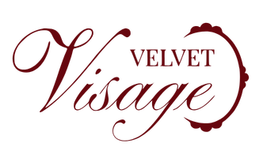

<picture>
  <source media="(prefers-color-scheme: dark)" srcset="assets/logo-horizontal.png">
  <source media="(prefers-color-scheme: light)" srcset="assets/logo-horizontal-dark.png">
  
</picture>

### Tecnologia e beleza caminhando juntas pensando em você.

---

## ✨ Sobre o projeto

O **Velvet Visage** é um projeto voltado à personalização e descoberta no universo da beleza, utilizando tecnologia e inteligência artificial para oferecer experiências e recomendações adaptadas às características e preferências de cada usuário.

Este repositório contém o **website institucional e promocional do Velvet Visage**, desenvolvido para apresentar o aplicativo, sua proposta, funcionalidades e equipe responsável pelo projeto.

> **"Tecnologia e beleza caminhando juntas pensando em você."**

---

## 🌐 Acesse o website

Conheça o **Velvet Visage** e descubra mais sobre o aplicativo, suas funcionalidades, proposta e equipe.

🔗 **[Acessar o website do Velvet Visage](https://velvet-visage.github.io/velvet-visage/)**

---

## 📌 Integrantes do Grupo

- Ana Luíza Machado de Andrade 
- Ana Luiza Marchiori Rodrigues 
- Barbara Gonçalves de Araujo 
- Beatriz Gagliano Silva 
- Caroline Fantinate de Assunção 

---

## 🎯 Objetivo do website

O website foi desenvolvido para:

- Apresentar o aplicativo Velvet Visage;
- Divulgar sua proposta e seus principais diferenciais;
- Apresentar as funcionalidades oferecidas pelo aplicativo;
- Apresentar a equipe responsável pelo projeto;
- Direcionar o público para o futuro download do aplicativo.

---

## 📱 Sobre o aplicativo Velvet Visage

O **Velvet Visage** é a aplicação principal do projeto e tem como proposta unir **tecnologia, inteligência artificial e beleza** para proporcionar uma experiência mais personalizada aos usuários.

Entre seus principais recursos estão:

- **Análises personalizadas de beleza**, incluindo coloração pessoal, pele, cabelo e maquiagem;
- **Recomendações personalizadas** de acordo com as características e resultados obtidos nas análises;
- **Sugestões de maquiagem e cabelo**, auxiliando o usuário na descoberta de opções que valorizem suas características;
- **Revista digital**, com conteúdos, dicas, novidades e tendências relacionadas ao universo da beleza;
- **Conexão com profissionais da área da beleza**, aproximando usuários de especialistas.

> **Observação:** o aplicativo encontra-se em desenvolvimento. Algumas funcionalidades e recursos apresentados podem estar sujeitos a alterações durante o desenvolvimento do projeto.

---

## 🖥️ Tecnologias utilizadas

O website foi desenvolvido utilizando:

- **HTML5** — estrutura e organização das páginas;
- **CSS3** — estilização, identidade visual e responsividade;
- **JavaScript** — interações e componentes dinâmicos.

---

## 📄 Licença

Este projeto foi desenvolvido para fins acadêmicos como parte do **Trabalho de Conclusão de Curso (TCC)**.