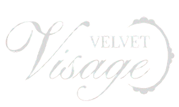

### Tecnologia e beleza caminhando juntas pensando em você.

---

## ✨ Sobre o projeto

O **Velvet Visage** é um aplicativo voltado à personalização e descoberta no universo da beleza, utilizando tecnologia e inteligência artificial para oferecer experiências e recomendações adaptadas às características e preferências de cada usuário.

Este repositório contém o **website institucional e promocional do Velvet Visage**, desenvolvido com o objetivo de apresentar o aplicativo, sua proposta, funcionalidades, identidade visual e equipe responsável pelo projeto.

Por meio de uma experiência visual e interativa, o website busca **divulgar o aplicativo Velvet Visage e aproximar o público de sua proposta**, apresentando seus principais recursos e diferenciais.

> **"Tecnologia e beleza caminhando juntas pensando em você."**

---

## 🌐 Acesse o website

Conheça o **Velvet Visage** e descubra mais sobre o aplicativo, suas funcionalidades, proposta e equipe.

🔗 **[Acessar o website do Velvet Visage](https://velvet-visage.github.io/velvet-visage/)**

---

## 📌 Integrantes do Grupo

* Ana Luíza Machado
* Ana Luíza Marchiori
* Bárbara Gonçalves
* Beatriz Gagliano
* Caroline Fantinate

---

## 🎯 Objetivo do website

O website foi desenvolvido para:

- Apresentar o aplicativo Velvet Visage;
- Divulgar sua proposta e seus principais diferenciais;
- Apresentar as funcionalidades oferecidas pelo aplicativo;
- Apresentar a equipe responsável pelo projeto;
- Comunicar a identidade visual da marca;
- Direcionar o público para o futuro download do aplicativo;

---

## 📱 Sobre o aplicativo Velvet Visage

O **Velvet Visage** é a aplicação principal do projeto e tem como proposta unir **tecnologia, inteligência artificial e beleza** para proporcionar uma experiência mais personalizada aos usuários.

Entre seus principais recursos estão:

- **Análises personalizadas de beleza**, incluindo coloração pessoal, pele, cabelo e maquiagem;
- **Recomendações personalizadas** de acordo com as características e resultados obtidos nas análises;
- **Sugestões de maquiagem e cabelo**, auxiliando o usuário na descoberta de opções que valorizem suas características;
- **Revista digital**, com conteúdos, dicas, novidades e tendências relacionadas ao universo da beleza;
- **Conexão com profissionais da área da beleza**, aproximando usuários de especialistas;
- Add outras

---

## ✨ Sobre o website

A landing page foi desenvolvida como uma **ferramenta de divulgação do aplicativo**, apresentando de forma visual e objetiva as principais informações sobre o Velvet Visage.

### Principais seções

#### 🏠 Página inicial

Apresentação inicial da marca e do aplicativo, destacando sua proposta e identidade visual.

#### 💎 A Velvet

Apresentação dos valores, propósito e equipe responsável pelo desenvolvimento do Velvet Visage.

#### ✨ Funcionalidades

Apresentação dos principais recursos oferecidos pelo aplicativo.

#### 📲 Download

Área destinada ao acesso às plataformas de download do aplicativo.

> **Observação:** atualmente os botões de download são representativos, posteriormente será possível instalar o aplicativo.

---

## 🎨 Identidade visual

A identidade visual do website foi desenvolvida para transmitir uma sensação de **elegância, delicadeza, sofisticação e modernidade**, alinhada à proposta do Velvet Visage.

## 🖥️ Tecnologias utilizadas

O website foi desenvolvido utilizando:

- **HTML5** — estrutura e organização das páginas;
- **CSS3** — estilização, identidade visual e responsividade;
- **JavaScript** — interações e componentes dinâmicos;
